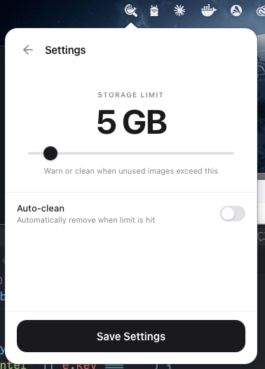
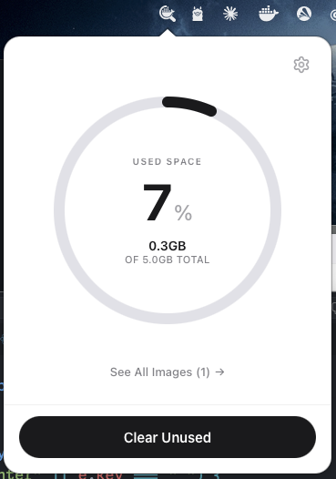

# DockerLens

A lightweight macOS menu bar app that monitors and cleans unused Docker images. Sits in your tray, shows storage usage at a glance, and lets you reclaim disk space in one click.


|   |   |
|---|---|
|  |  |

## Features

- **Menu bar native** — runs as a tray icon, no dock clutter
- **Real-time monitoring** — background polling detects unused Docker images automatically
- **Storage bar** — visual indicator with warning/danger thresholds
- **One-click cleanup** — remove individual images or all unused at once
- **Auto-clean mode** — automatically remove images when your storage limit is hit
- **macOS notifications** — get alerted when unused images exceed your threshold
- **Configurable** — set storage limits (1-50 GB), poll intervals (30s to 10m)
- **No Docker CLI dependency** — talks directly to the Docker Engine API over Unix socket

## Install

### Download (recommended)

1. Grab the latest `DockerLens_*_universal.dmg` from [Releases](../../releases) — one download works on both Intel and Apple Silicon Macs.
2. Open the DMG and drag **DockerLens** to **Applications**.

> **First launch — approve it once.** DockerLens is not yet code-signed, so macOS Gatekeeper blocks it the first time. Pick either:
>
> - **Terminal (fastest):**
>   ```bash
>   xattr -cr /Applications/DockerLens.app
>   ```
>   then open the app normally.
>
> - **No Terminal:** double-click DockerLens (you'll get a "cannot be opened" warning), then open **System Settings → Privacy & Security**, scroll to the bottom, and click **Open Anyway**.
>
> You only need to do this once.
>
> _DockerLens has **no dock icon** — after launch, look for its icon in the menu bar (top-right). It opens automatically the first time so you can find it._

## Usage

1. **Click the tray icon** to open the popover
2. **Images tab** — see all dangling/unused images with size, age, and a delete button
3. **Settings tab** — configure storage limit, auto-clean, and poll interval
4. The app polls Docker in the background and updates automatically

## Requirements

- macOS 13 (Ventura) or later
- Docker Desktop or Docker Engine running

## Building from source

```bash
git clone https://github.com/InumanSoul/dockerlens.git
cd dockerlens
npm install
npx tauri dev            # dev mode with hot reload
npx tauri build          # production .app + .dmg
```

**Prerequisites:** Node.js 20+, Rust (stable), Xcode Command Line Tools.

## Tech Stack

| Layer | Tech |
|-------|------|
| Backend | Rust, Tauri v2, hyper 0.14 + hyperlocal (Unix socket) |
| Frontend | React 18, TypeScript, Vite |
| Persistence | tauri-plugin-store |
| Notifications | tauri-plugin-notification |

## Contributing

Pull requests welcome. For major changes, open an issue first.

## License

[MIT](LICENSE)
